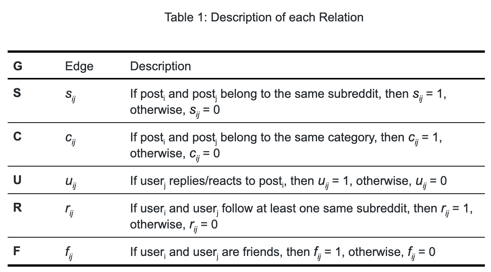

# HinReddit

- [HinReddit](#hinreddit)
  - [1. Sentiment Analysis of Reddit Posts](#1-sentiment-analysis-of-reddit-posts)
  - [2. Relation with HinDroid](#2-relation-with-hindroid)
  - [3. Related Works](#3-related-works)
  - [4. Techniques](#4-techniques)
      - [4.1. Data Ingestion](#41-data-ingestion)
      - [4.2. Labeling Training Data](#42-labeling-training-data)
      - [4.3. Classification Problem](#43-classification-problem)
  - [5. Backlog](#5-backlog)
      - [Project Checkpoint 1](#project-checkpoint-1)
  - [6. Weekly Schedule](#6-weekly-schedule)
      - [Project Checkpoint 1](#project-checkpoint-1-1)
      - [Project Checkpoint 2](#project-checkpoint-2)
      - [Project Checkpoint 3](#project-checkpoint-3)
  - [7. Citations](#7-citations)
  

## 1. Sentiment Analysis of Reddit Posts

As countless social platforms are developed and become accessible nowadays, more and more people get used to posting opinions on various topics online. These platforms thus become prolific sources for opinion mining, which motivates large numbers of scholars to apply various techniques in order to perform sentiment analysis. 

In our project, we plan to investigate contents from Reddit, which is also a popular social network that focuses on aggregating American social news, rating web content and website discussion, that carries rich potential information of contents and their authors. Our goal is to classify sentiment level of Reddit posts. The contents of these posts vary from personal opinions and interests to public discussions and statements. Being able to analyze posts sentimentally not only enriches platforms and organizations with feedbacks, but also helps to maintain a positive online environment by identifying the more negative posts and communities.

We plan to use Bidirectional Encoder Representations from Transformers (BERT), a neural network architecture transforming natural language processing (NLP) techniques, in our data ingestion pipeline for data labeling. However, instead of using NLP in attempts to solve classification problems, we will be using graph embedding methods. Specifically, we will create a heterogeneous information network to capture the relationships among Reddit posts, which is then used as our features.

If our project is successful, we will have built an application, *hinReddit*, which helps classify sentiment level of posts and identify more negative ones for Reddit. Similarly, others can apply our process on different social platforms. In addition, we will create a blog post including an EDA on the data we extracted, a map of subreddit communities by sentiment level, and detailed description of the process we will complete to ingest data. We will perform feature engineering, develop a neural network model, and finally a summary of the test result of our model.

## 2. Relation with HinDroid

Performing sentiment analysis on  Reddit posts is similar to our domain problem of detecting Android malware both conceptually and technically. Despite using different platforms, these two case studies both aim at grouping similar units from the entire population, with ours by sentiment level and the other by malicious level, and the goals are to produce a healthier and more positive environment to users by identifying the more negative units. As we did in our replication using graph embedding techniques, here in our study, we will also pay attention to the connections as well as the communities of our object and construct heterogeneous information network (HIN) upon those connections that enables further training and classifications. 

Specifically, in our HIN graph, we will have Reddit post nodes equivalent to App nodes in the replication project and user-interaction nodes equivalent to API nodes in the replication. While Hindroid investigates more of the relationships among API calls, for instance, having three out of four matrices developing different interactions of APIs, and thus focuses less on relationships among Apps themselves, we plan to add to our HIN the relationship among Reddit post nodes themselves to further diversify our network graph. 

## 3. Related Works

Studies regarding the detection of negative speech, content, and user in Online Social Networks have been manifold. In the report Characterizing and Detecting Hateful Users on Twitter, the authors present an approach to characterize and detect hate on Twitter at a user-level granularity. Their methodology consists of obtaining a generic sample of Twitter’s retweet graph, finding potential hateful users who employed words in a lexicon of hate-related words and running a diffusion process to sample more hateful users who are closely related in the neighborhood to those potential ones. However, there are still limitations to their approach. Their characterization has behavioral considerations of users only on Twitter, which lacks generality to be applied to other Online Social Networks platforms. Also, the definition of 'hateful' is vague and unclear in this specific work as well as many similar works. With our effort in reviewing relevent papers and websites, we find no unity nor clarity in defining the boundaries of 'hate.' Therefore, with ethical concerns, instead of labeling hate, we want to avoid tagging individuals or posts and believe that detecting attitude on a sentiment-level will be more impartial.

## 4. Techniques
The project has three main challenges: data ingestion, labeling training data for supervised learning, and finally our classification problem. 

#### 4.1. Data Ingestion

To obtain our dataset, we will make use of API `PRAW` (Python Reddit API Wrapper) to obtain Reddit user information, including friend list and following subreddits, and API `pushshift` to obtain Reddit post information, including post text, title, and user ids who reply to either the post itself or any of the reply below the post. We use `pushshift` because it offers a specific API to obtain the flattened list of repliers' ids and takes considerably less time than doing the same with `PRAW`.

The challenge lies in the fact that the text data takes a considerably large space, so it is important for us to select the right subset of data that is available. Currently, we are planning to randomly sample a number of posts from a subset of subreddits in each category within the most recent year. The exact number is to be decided after we actually create data ingestion pipeline and learn the time/space resource we need.

#### 4.2. Labeling Training Data

After we obtain Reddit posts data, we will then divide it into training and test sets. Since we are going to perform supervised learning, labels for the training data are necessary. We will employ an pretrained model, BERT, along with python library `transformers` to help us.

#### 4.3. Classification Problem

Finally, with labeled training data In our project, we will use heterogeneous information network graph to depict relations among reddit posts and users, which are the two kinds of nodes in our HIN. We have proposed a few relations, that we may include in our HIN. The details of relations are shown below in Table 1. We will then apply node2vec to the HIN constructed, which provides us with the vector representation of each post. The result will become the input layer in our neural network to perform binary classification.

## 5. Backlog

#### Project Checkpoint 1

- Reddit post ingestion
  * Create functions to obtain information of a Reddit post given post id/link, and save the information as a csv file. Information includes text content, post id, post title.
  * Create functions to obtain all reply ids (flattened) given post ids, and save the information as a json file.
  * Create functions to obtain information of a reply given its id, and save the information as a csv file. Information includes author id and post id of the reply.
  * Put functions together and create a reddit post ingestion pipeline.
  * Test this pipeline and check outputs on DSMLP server, debug if needed.
 
- Reddit user info ingestion
  * Create functions to obtain user information given an user id, save as json file. Information includes friend id list and following subreddits.
  * Put functions together and create user info ingestion pipeline.
  * Test this pipeline and check outputs on DSMLP server, debug if needed.
 
- Labeling
  * Use BERT and PyTorch with library `transformers` to create functions to label text.
  * Put functions together and create a labeling pipeline.
  * Test this pipeline on DSMLP server, debug if needed.
   
- EDA functions
  * Create functions for EDA with small dataset.
   
- Documentation
  * Consult past researches on hateful speech detection and sentimental analysis.
  * Revise proposal
  * Revise weekly schedules and create backlog
  * Report: Datasets, Obtaining Data, Data Ingestion Process: Data Origination and Legal Issues, Data Privacy, Applicability, Schema, Pipeline

## 6. Weekly Schedule

#### Project Checkpoint 1

**Week 1:**

Goal: Create data ingestion pipeline to download reddit post content along with user information.

Tasks: 

- Shuibenyang
  * Create functions to obtain information of a Reddit post given post id/link, and save the information as a csv file. Information includes text content, post id, post title.
  * Create functions to obtain all reply ids (flattened) given post ids, and save the information as a json file.
  * Create functions to obtain information of a reply given its id, and save the information as a csv file. Information includes author id and post id of the reply.
  * Put functions together and create a reddit post ingestion pipeline.
 
- Chengyu
  * Create functions to obtain user information given an user id, save as json file. Information includes friend id list and following subreddits.
  * Put functions together and create user info ingestion pipeline.
  * Test both ingestion pipelines and check outputs on DSMLP server, debug if needed.
   
- Yanyu
  * Consult past researches on hateful speech detection and sentimental analysis.
  * Revise proposal
  * Test all pipelines together and check outputs on DSMLP server, debug if needed.
 
- Yu-Chun
  * Revise weekly schedules and create backlog
  * Use BERT and Tensorflow to create functions to label text.
  * Put functions together and create a labeling pipeline.
  * Test this pipeline on DSMLP server, debug if needed.
  

**Week 2:**

Goal: Finish data ingestion pipeline, EDA, and labeling pipeline

Tasks:

- Shuibenyang
  * Continue
 
- Chengyu
  * continue
  * Create functions for EDA with small dataset.
  * Write report (Datasets, Obtaining Data)
  
- Yanyu
  * Continue
  * Revise proposal
  * Write report (Data Ingestion Process: Data Origination and Legal Issues, Data Privacy, Applicability)
   
- Yu-Chun
  * Continue
  * Revise weekly schedules and create backlog
  * Write report (Data Ingestion Process: Schema, Pipeline)

#### Project Checkpoint 2

**Week 3:**

Goal: HIN construction

Tasks: (individual tasks to be assigned)

* Download data and start EDA.
* Create functions for baseline model using extracted EDA data directly as features
* Put functions together to create a baseline model pipeline.
* Create functions to create matrix for each relation detailed above (will assign different relations to members)
* Put functions together to create a matrix pipeline.
* Report (Graphs, EDA, Baseline Model)

  

**Week 4:**

Goal: Apply node2vec to turn HIN into vector representation

Tasks: (individual tasks to be assigned)

* Finish creating functions to create a graph for each relation
* Create a function to combine the graphs
* Finish creating the HIN given our training data
* Create functions that take in an HIN graph to create vectors for each post node 

#### Project Checkpoint 3

**Week 5:**

Goal: Start constructing neural network

Tasks: (individual tasks to be assigned)

* Create functions that take in a new Reddit post and output its vector representation given our trained HIN
* Create functions that train a neural network with vectors we transformed from the HIN
* Train vectors we obtain from our HIN

**Week 6:**

Goal: Finish testing and record result

Tasks: (individual tasks to be assigned)

* Determine ideal metric
* Test on the testing dataset
* Compare result to that of the baseline model
* Discuss possible cases where pretrained model fail to identify hateful posts but our proposed methods do
* Create Visualization of most positive and negative subreddits community
* Report (Results, Conclusion)
  
**In each week, we will also record process and document related sections for the final report*

## 7. Citations

**Reddit APIs**
PRAW: https://praw.readthedocs.io/en/latest/
pushshift: https://github.com/pushshift/api 

**transformers and BERT**
https://github.com/huggingface/transformers
https://huggingface.co/transformers/model_doc/bert.html