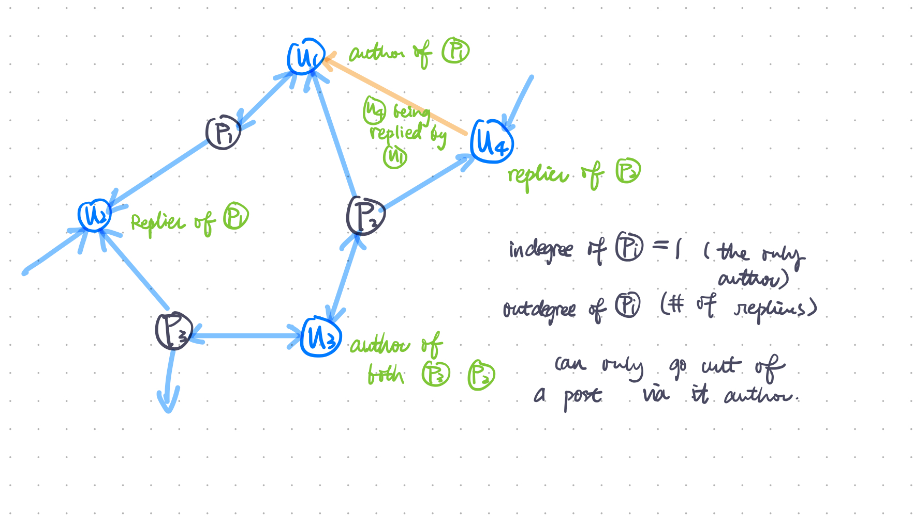

# HinReddit

- Chengyu Chen 
- Yu-chun Chen
- Yanyu Tao
- Shuibenyang Yuan

<script type="text/x-mathjax-config">
MathJax.Hub.Config({
tex2jax: {
inlineMath: [['$','$'], ['\\(','\\)']],
processEscapes: true},
jax: ["input/TeX","input/MathML","input/AsciiMath","output/CommonHTML"],
extensions: ["tex2jax.js","mml2jax.js","asciimath2jax.js","MathMenu.js","MathZoom.js","AssistiveMML.js", "[Contrib]/a11y/accessibility-menu.js"],
TeX: {
extensions: ["AMSmath.js","AMSsymbols.js","noErrors.js","noUndefined.js"],
equationNumbers: {
autoNumber: "AMS"
}
}
});
</script>

<div class="pagebreak"></div>

- [HinReddit](#hinreddit)
  - [1. Hateful Post Classification](#1-hateful-post-classification)
  - [2. Related Works](#2-related-works)
    - [Hindroid](#hindroid)
    - [Social Network Based Problems](#social-network-based-problems)
  - [3. The Data](#3-the-data)
    - [Dataset](#dataset)
    - [Data Ingestion Process](#data-ingestion-process)
      - [Data Origination and Legality](#data-origination-and-legality)
      - [Privacy Concerns](#privacy-concerns)
      - [Schema](#schema)
        - [Raw](#raw)
          - [First Layer: Posts](#first-layer-posts)
          - [Second Layer: Post detail](#second-layer-post-detail)
          - [Third Layer: Comments](#third-layer-comments)
      - [Pipeline](#pipeline)
        - [triggered by `data-(read/eda/test)` in targets](#triggered-by-data-readedatest-in-targets)
        - [triggered by `label` in targets](#triggered-by-label-in-targets)
        - [triggered by `baseline` in targets](#triggered-by-baseline-in-targets)
      - [Data Cleaning](#data-cleaning)
      - [Applicability](#applicability)
  - [3. Labeling](#3-labeling)
  - [4. Graph Extraction](#4-graph-extraction)
    - [Graph Structure](#graph-structure)
  - [5. EDA](#5-eda)
  - [6. ML Deployment](#6-ml-deployment)
    - [Metrics](#metrics)
    - [Baseline Model](#baseline-model)
    - [Hinreddit](#hinreddit-1)
      - [Node2vec](#node2vec)
      - [DGI](#dgi)
      - [NetMF](#netmf)
  - [6. Experimental Result](#6-experimental-result)
    - [Baseline Model Result](#baseline-model-result)
    - [Hinreddit Result](#hinreddit-result)
      - [Node2vec](#node2vec-1)
      - [DGI](#dgi-1)
      - [NetMF](#netmf-1)


## 1. Hateful Post Classification
As countless social platforms are developed and become accessible nowadays, more and more people get used to posting opinions on various topics online. The existence of nagetive online behaviors such as hateful comments is also unavoidable. These platforms thus become prolific sources for hate detection, which motivates large numbers of scholars to apply various techniques in order to detect hateful users or hateful speeches. 

In our project, we plan to investigate contents from Reddit, which is a popular social network that focuses on aggregating American social news, rating web content and website discussion, that carries rich potential information of contents and their authors. Our goal is to classify hateful posts from the normal ones. Being able to identify hateful posts not only enables platforms to improve user experiences, but also helps to maintain a positive online environment. **We would like to stress that the boundary of 'hate' is vague and there is no correct nor consolidated definition of 'hatefulness,' our classification of hateful posts depends only on a unified definition within our team, which we divide into the categories of `severe_toxic`,`threat`, `insult`, and `identity_hate`.** We all agree that other people's recognition of "hate" may be but not limited to these four categories, and our labeling method allows full freedom of other definition of "hatefulness."

We plan to use Bidirectional Encoder Representations from Transformers (BERT), a neural network architecture transforming natural language processing (NLP) techniques, in our data ingestion pipeline for data labeling. However, instead of using NLP in attempts to solve classification problems, we will be using graph embedding methods. Specifically, we will create a heterogeneous information network to capture the relationships among Reddit posts, which is then used as our features.

If our project is successful, we will have built an application, *hinReddit*, which helps identify hateful posts for Reddit. Similarly, others can apply our process on different social platforms. In addition, we will create a blog post including an EDA on the data we extracted and detailed description of the process we will complete to ingest data. We will perform feature engineering, develop a neural network model, and finally a summary of the test result of our model.

## 2. Related Works

### Hindroid

Detecting hateful posts on Reddit is similar to our domain problem of detecting Android malware both conceptually and technically. Despite using different platforms, these two case studies both aim at identifying the malicious units from the benign units, and the goals are to produce a healthier and more positive environment to users. As we did in our replication using graph embedding techniques, here in our study, we will also pay attention to the connections as well as the communities of our object and construct heterogeneous information network (HIN) upon those connections that enables further training and classifications.

Specifically, in our HIN graph, we will have Reddit post nodes equivalent to App nodes in the replication project and user-interaction nodes equivalent to API nodes in the replication. While Hindroid investigates more of the relationships among API calls, for instance, having three out of four matrices developing different interactions of APIs, and thus focuses less on relationships among Apps themselves, we plan to add to our HIN the relationship among Reddit post nodes themselves to further diversify our network graph. 

### Social Network Based Problems

Studies regarding the detection of hateful speech, content, and user in Online Social Networks have been manifold. In the report Characterizing and Detecting Hateful Users on Twitter, the authors present an approach to characterize and detect hate on Twitter at a user-level granularity. Their methodology consists of obtaining a generic sample of Twitter’s retweet graph, finding potential hateful users who employed words in a lexicon of hate-related words and running a diffusion process to sample more hateful users who are closely related in the neighborhood to those potential ones. However, there are still limitations to their approach. Their characterization has behavioral considerations of users only on Twitter, which lacks generality to be applied to other Online Social Networks platforms. Also, with ethical concerns, instead of labeling hate on a user-level, we want to avoid tagging individuals and believe that detecting hate on a content-level will be more impartial.

## 3. The Data

### Dataset

Our project includes two datasets:
   
1. Main dataset used for our project analysis
    This is a dataset we will obtain from Reddit through a couple APIs. We use the API called [PushShift](https://github.com/pushshift/api) to obtain Reddit post information, including post text, title, and user ids who reply to either the post itself or any of the reply below the post and the comments that it provided. We use `PushShift` because it offers a specific API to obtain the flattened list of repliers' ids and takes considerably less time than doing the same with [PRAW](https://praw.readthedocs.io/en/latest/). After a brief EDA on the most popular 124 subreddits, we select 50 subreddits in which the proportion of valid text posts of the posts are the highest and then sample a number of newest posts in each of the 50 subreddits. By doing this, our data will represent a population of newer posts in subreddits whose posts have higher text-proportion. We want to eliminate image/meme posts and deleted posts so we can better apply NLP model for our supervised learning.
<br>
   - advantages:
      - This dataset is obtained from the actual social platform, and thus we obtain real-world perspective when training.
      - Reddit has a couple APIs for us to suit our different needs.
    - limitations:
      - There are no ground-truth labels we can use for the data we collect, and thus need the assistance of other well-defined and pre-trained models to first label our data.
      - We are not certain of the level of hatefulness from Reddit posts we obtain, and may lead to an unbalanced number of posts in benign and hateful categories.
      - Our dataset will include newest posts in each subreddit, and may not apply well for older posts.
<br>

2. Kaggle Toxic Comment Classification Dataset
    This is a dataset provided on https://www.kaggle.com/c/jigsaw-toxic-comment-classification-challenge/data, including information of hundreds of thousands of wikipedia comments along with multiple negative labels. We will be mainly using this dataset to train a nlp pretrained BERT classifier model to label our reddit post data before we use it for HIN learning. 
<br>
   - advantages: 
      - This dataset is labeled, allowing us to perform supervised learning to train a nlp classifier model.
      - The dataset include several labels, including `severe_toxic`, `obscene`, `threat`, `insult`, `identity_hate`, thus giving us some space to define what constructs a hateful post.
    - limitations:
      - We are not certain if labels for wikipedia comments can be applied to posts from Reddit or other social platforms.
<br>

### Data Ingestion Process

#### Data Origination and Legality
   
1. Our data entirely originates from [Reddit](https://www.reddit.com). We will be using the Reddit APIs to obtain the data from the website. As stated in Reddit's [API Terms of Use](https://www.reddit.com/wiki/api-terms), in order to legally use the Reddit API, it is necessary for us to agree with all the applicable policies and guidelines listed in the Terms of Use. With a careful review of the document, we understand that we have satisfied all requirements and grant consent on all Terms. Moreover, since we have registered Reddit accounts agreeing with all terms and conditions, we believe our usage of the Reddit API is legal. 

2. The Kaggle Toxic Comment Classification data originates from the comments of Wikipedia’s talk page edits and is distributed through a closed Kaggle competition. According to the [Competition Rules](https://www.kaggle.com/c/jigsaw-toxic-comment-classification-challenge/rules), for the specific "competition data", or the datasets available from the the Competition Page for the purpose of use in the Competition, users are allowed to access or use the data for academic research and education, or non-commercial purposes. Our usage of the data will not violate the rules. 

#### Privacy Concerns
As [Reddit](https://www.reddit.com) is an online public social platform and all posts and replies are open to viewers, we will not get into issues regarding privacy. Nevertheless, we will encrypt all users' personal information if involved and eliminate sensitive posts or replies in case of any information leakage.

#### Schema
After extracting the posts and comments using the `PushShift` API, we have organized the data into three layers. As shown below, under the raw folder it contains the three layers, *post_detail*, *posts* and *comments*. The name of the files under each folder corresponds to each subrredit where the contents are taken from. 

```source
data/
|--raw/
|  |-- post_detail/
|  |   |-- science.json
|  |   |-- videos.json
|  |-- posts/
|  |-- |-- science.csv
|  |-- |-- videos.csv
|  |-- comments/
|  |   |-- science.csv
|  |   |-- videos.csv

```

##### Raw

###### First Layer: Posts

The csv file contains the information of each post in a dataframe where the unit of observation is the individual post. <br>
`id`: post_id
`author`: username of the author who make the post
`title`: title of the post
`selftext`
`num_comments`: number of comments
`created_utc`: the epoch date for which the post is created
`full_link`: the link to the reddit post
`subreddit`: subreddit it belongs to
`score`: number of upvote - number of downvote

###### Second Layer: Post detail

The file contains certain number of posts id and all of its comments id under a certain subrredit. <br>
`submission_id` : id of the post
`comment_ids`: id of each comment
```json
[{"submission_id":"fsoala","comment_ids":[]},
{"submission_id": "fsnmj4", "comment_ids": ["fm2fd48", "fm2hrmh", "fm2k37i", "fm2k8p4", "fm2kuot", "fm2lces", "fm2lsao", "fm2lu4n", "fm2m5at", "fm3trkl", "fm4c7i6"]}]
```

###### Third Layer: Comments

The csv file contains the information of each specific post in a dataframe where the unit of observation is the individual comment. <br>
`id`: comment id
`author` : username of the author who make the comment
`created_utc` : the epoch date for which the comment is made
`is_submitter`: whether that person post the original post
`subreddit`: the subreddit it belongs to
`link_id`: the post id for which this comment is made for
`send_replies`

#### Pipeline

##### triggered by `data-(read/eda/test)` in targets

- Create `config/data-params.json`, an example shown below. Information includes: POST_ARGS: parameter related to the post extraction part. META_ARGS: parameter related to the comment extraction part. The all the posts is sorted by the creation data and we extracted data prior to the date of `Tuesday,March 31 17:00:00 2020 PDT`.
```json
{"POST_ARGS":
    {"sort_type":"created_utc",
    "sort":"dsc",
    "size":"1000",
    "start":"1585699200"},
"META_ARGS":
    {"filepath":".\/tests",
    "total":"1000",
    "meta":["id","author","title","selftext","num_comments","created_utc","full_link","subreddit","score"],
    "subreddits":["amitheasshole","showerthoughts","politics","documentaries"]}}
```

- Sample a number of newest posts prior to a chosen daytime, the number specified in configuration file, from each subreddits specified in configuration file.

- Access and obtain reddit posts, reorganize, and same them as detailed in [schema](#53-schema)

##### triggered by `label` in targets

- Train a multi-label classification model using `Keras` deep learning NLP model and kaggle dataset.

- Use the model to label post csv files stored in post path.

- Store the label csv files in label path.

##### triggered by `baseline` in targets

- Extract simple features detailed in [baseline](#8-baseline-model) section.

- Use the features to train linear regression, random forest, and gradient boost classifiers.

- Use the baseline models to predict labels and store the result in output directory.

#### Data Cleaning

Since we are directly using the Pushshift API, it has taken care most of the data cleaning parts. Since the output of the result is in .json format, thus the only transformation we have to make is to use pandas to output the result in .csv format. 

#### Applicability

The above data ingestion pipeline can be used to obtain data as long as the data originates from Reddit. Our pipeline has limited applicability depending on data sources. Possible data sources include other online social platforms such as Twitter, Facebook, LinkedIn, and Instagram. Platforms have similar overall structure but differ in detailed construction and API calls, thus our pipeline may only be helpful for general data ingestion framework reference  when applying to other online social platforms. Also, it is important to check the policies and guidelines of each platform before employing our pipeline to avoid the raise of legal issues or privacy concerns. 

## 3. Labeling

Since the original data obtained from Reddit is not labeled, we will be using a RNN and bidirectional layers, through python library `keras`, as well as pre-trained word representation vectors from GloVe, to label the Reddit posts before we use it for our project main analysis.

By following a [tutorial](https://androidkt.com/multi-label-text-classification-in-tensorflow-keras/) of using `keras` and the pretrained word vectors, we will train a multi-label NLP model with kaggle labeled dataset of wikipedia comments detailed in [Datasets](#4-datasets). We will save this model in directory `interim`. This multi-label model then can be used to classify each Reddit post as "hateful" according to either our definition, which is any of `toxic`, `severe_toxic`, `threat`, `insult`, `identity_hate`, or user-defined "hatefulness" using any combination of the five labels. 

We will label a post as hateful if the max of the 5 values is greater than 0.5 or one of the comment has a mean among the 5 values that is greater than 0.5. Otherwise it will be labled as benign. If the post is removed it will be labeled as deleted and the NA post will also be labeled as NA.

## 4. Graph Extraction

### Graph Structure

the graph structure is shown as below:



The graph consists two kind of nodes:

- Post Node: the post group
- User Node: the user group
  - Author Node: author of the post
  - Commentor Node: commentors who answer the post or comments under the posts
  - Note: Author Nodes and Commentor Nodes can be overlapped

The graph rule is explained as following:

- Post Nodes can go to all User Nodes under them directly (both Author and Commentor).
- Author Nodes can only go to Post Nodes they associate with.
- Commentor Nodes can only go to User Nodes who reply them.

We will represent our Graph into following Adjacency matrix form:

``` math
- U matrix
  - if user i has been replied by user j, then i,j entry of U will be added 1
- P matrix
  - if post i has author or commentor j, then i,j entry of P will be added 1
- A matrix
  - if author i writes post j, then i,j entry of A will be 1

```

Example:

``` text
we have two reddit posts with id 1 and 2 shown below

post_id: 1
author_user_id: 1
  commentor_user_id: 2
    commentor_user_id: 3
post_id: 2
author_user_id: 2
  commentor_user_id:4
  commentor_user_id:2

The Matrices will be:

U:  0|0|0|0
    0|0|1|0
    0|0|0|0
    0|1|0|0

P:  1|1|1|0
    0|1|0|1

A:  1|0
    0|1
    0|0
    0|0

N:  0|0|0|0|1|0
    0|0|1|0|0|1
    0|0|0|0|0|0
    0|1|0|0|0|0
    1|1|1|0|0|0
    0|1|0|1|0|0

```

## 5. EDA

As you may know, Reddit has already banned lots of subreddit that contained explicit or controversial materials. Thus in order to discover more hateful speech, we researched online and find out a [list](https://www.reddit.com/r/GoldTesting/comments/3fxs3q/list_of_quarantined_subreddits/) contained both banned and quarantined subreddits. Quarantined subreddits are subs that host no advertisement, and Reddit doesn't generate any revenue off toxic content. People can still acess those subs, but there will be a prompt warns telling people about the content on the sub. We have selected around 37 qurantined subreddit along with 10 normal subreddits. </br>
By using the data ingestion pipeline, we have successfully extracted 5,000 posts from each of the 47 subreddits which is 235,000 posts in total. For each of the subreddit we have calculated **total_comment**: the total number of comments recieved for the posts contained in that subreddit, **avg_comment**: average number of comments received for the posts contained in that subreddit, **top_num_comment**: the maximum number of comments recieved by a post in that subreddit. The statistics for the top 5 subreddits that have the most total comments are shown in the table below. From the table, we can observe that the subreddit with higher number of total_comments also has higher number of average_comment. And we also want to figure out whether those hot subreddit also tend to contain more hateful speech. 
|subreddit|total_comment|avg_comment|top_num_comment|
|---------|-------------|-----------|---------------|
|Politics (r/politics)|374,963|74|12,837|
|Pussy Pass Denied (r/pussypassdenied)|352,941|70|2,202|
|TumblrInAction: O Toucan, Where Art Thou? (r/TumblrInAction)|311,407|62|1,571|
|conspiracy (r/conspiracy)|223,516|44|949|
|KotakuInAction: The almost-official GamerGate subreddit! (r/KotakuInAction)|158,596|31|2,331|
<br>
Thus we looked at the subreddit that has the most hateful posts. Below shows the top 5 subreddits. 
<br>

|subreddit|deleted|benign|hateful|
|---------|-------|------|-------|
|Incest|1,067|3,295|609|
|Today I Fucked up(r/tifu)|771|3,708|487|
|TheRedPill|1,564|2,565|452|
|Jokes|766|3,758|405|
|Unpopularopinion)|1,590|2,855|404|

<br>
We then look at the labels at a higher level without group them into different subreddits. The table below shows the distribution of the labels among posts.  
<br>

|label|% post|
|-----|------|
|deleted|10.8%|
|benign|84%|
|hateful|4.7%|
<br>
Dig deeper into the content of the posts for different labeling groups, we investigate on the length of the content. From the table below, it shows that even though the min and max of the length of content in each group is around the same, the average length of content for posts that are labled hateful is more than double of the average length of content for posts that are labled benign. Thus we can add this as one of our feature. 

|label|mean|min|max|
|-----|----|---|---|
|benign|82.87|1|7549|
|hateful|176|1|7048|

Another feture could be the number of comments under each post. 
The average length of comment for posts labeled hateful is relatively smaller than that for posts labeled as benign. 
|label|min|max|mean|
|-----|---|---|----|
|benign|0|9,783|24|
|hateful|0|2,043|16|
<br>
Moreover we also find difference in score for the two groups, the mean score of benign posts are generally higher than those of hateful posts.

|label|mean_score|
|-----|----------|
|benign|32|
|hateful|11|
Moreover, in order to evaluate the quality of the label, we have also done some textual analysis. We find out the top 30 words in posts after removing stop words for each of the groups. However, we have also removed about 20 words that appeared in both groups. Those should be the common words that appeared in the conversation and thus is not helpful as a feature for our classification. 

|malign_word|count|benign_word|count|
|-----------|-----|-----------|-----|
|fuck|5,835|amp|13,155|
|nigger|4,078|work|12,508|
|fucking|3,233|feel|12,388|
|shit|2,907|right|12,208|
|place|2,713|gt|11,256|
|sex|2,200|things|11,244|
|started|1,840|new|11,002|
|ass|1,800|need|10,629|
|went|1,717|years|10,374|


## 6. ML Deployment

### Metrics

Since we are performing binary classification, `True Positive, True Negative` plays a more crutial role in our classification model. Also, our label is extremely unblanced with few positive labels and much more negative labels. Becuse graph technique will be significantly influenced (invalided) by traditional balancing data technique like over-sampling and under-sampling, we will be evaluate our model with fowllowing metrics: `Recall, AUC, and Precision`. To catch more potential hateful posts, we favor Racall over Precision.

### Baseline Model

We use Logistic Regression, Random Forest, and Gradient Boost Classifier to train our models based on the features `['num_comments', 'subreddit', 'score', 'length', 'title_length']` and classify whether a post is hateful.


`num_comment`: number of comments for each post
`subreddit`: the subreddit that the post belongs to
`score`: the upvote score that the post receives
`length`: the length of text body of the post
`title_length`: the length of the title

### Hinreddit

Hinreddit will present methodologies over following graph techniques: `Node2vec`, `DGI`, and `NetMF`

#### Node2vec

The Node2vec model from the ["node2vec:Scalable Feature Learning for Networks"](arXiv:1607.00653) paper where random walks of length `walk length` are sampled in a given graph, the embedding is learned by negative sampling optimization.


#### DGI

DGI, Deep Graph Infomax, model from the ["Deep Graph Infomax"](arXiv:1809.10341 ) paper based on user-defined encoder and summary model $$\epsilon$$ and $$R$$ respectively, and a corruption function $$C$$

We use implementation from `pytorch_geometric` for our modeling to get the Graph embedding of latent features.

#### NetMF

LATER

## 6. Experimental Result

### Baseline Model Result

Our current dataset is splited into 70% training and 30% test.The resulting metrics for each classifier regarding the performance on the test set are listed in the table below.

||tn|fp|fn|tp|acc|fnr|
|-----|---|---|---|---|---|---|
|Logistic Regression|40,593|0|341|0|0.991670|1.0|
|Random Forest|40,593|0|341|0|0.991670|1.0|
|Gradient Boost Classifier|40,580|13|341|0|0.991352|1.0|

From the table above, we can observe that the performances of the three classifiers by accuracy scores are all around 0.99. Despite the high accuracy, the three classifiers are trained askew to negatively classify data due to the extreme imbalance of our dataset. In order to balance our negative and positive data, we come up with several possible solutions included in backlog.

### Hinreddit Result

In hinreddit, we split our dataset into 70% training, 15% validation, and 15% testing.

#### Node2vec


#### DGI


#### NetMF


<!-- ## 9. Proposal Revision

Since the last checkpoint, due to the difficulty encountered during the implementation of BERT models, we switch to bidirectional RNN model that can be implemented through `keras` when it comes to training a model to label the post data we downloaded. The process closely follows instructions in the [link](https://androidkt.com/multi-label-text-classification-in-tensorflow-keras/). We also use word vector representations, called Global Vectors for Word Representation that can be downloaded [here](https://nlp.stanford.edu/projects/glove/).
<br>
We have also add the data population of interest that we missed to include for checkpoint 1 in section 4.1.

## 10. Backlog

* Besides using post body text to identify hateful ones, also use comments. In other words, label the post as hateful if the comments have higher proportion of hatefulness.
* Manually search for controversial subreddits and ingest data from such to include more potential hateful data
* Reingest data from our current sampled subreddits and obtain comments under each post; post will be labelled as hateful based on the contents of the post itself as well as the comments and conversations going on under the post
* If the above changes cannot effectively solve the problem, we will consider making adjustment to our data ingestion pipeline and change our data structure from post level to thread level, which will also help to lower the dimension of our meta path in the HIN process. 
* Include parameters to make more space for the definition of hatefulness.
* Update pipeline so the labeling part can directly saves uses the saved model to label data.
 -->
